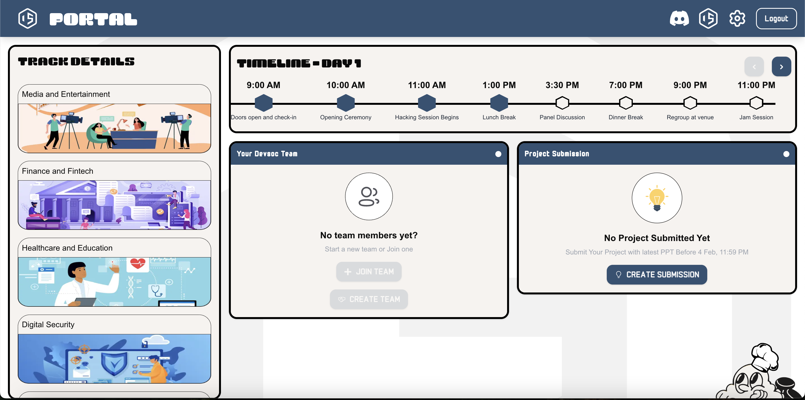
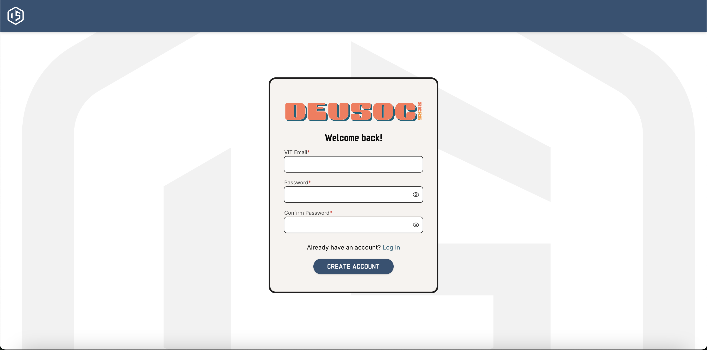
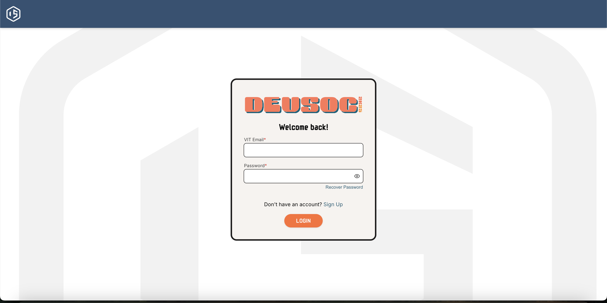
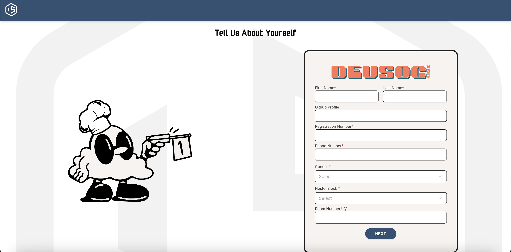
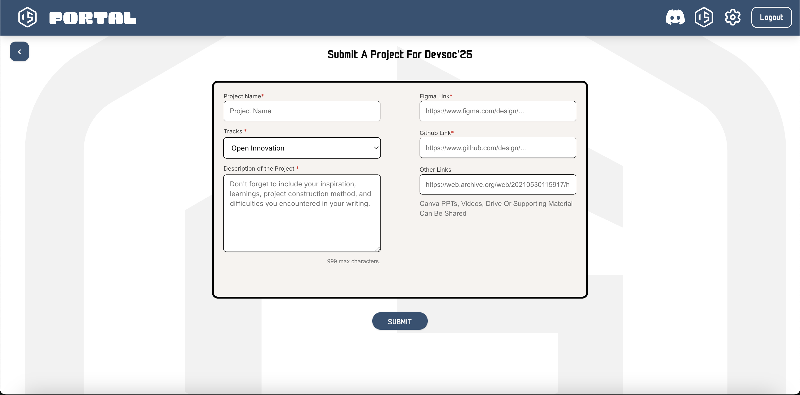
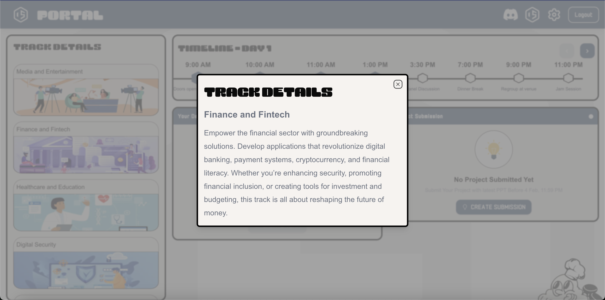

<p align="center"><a href="https://www.codechefvit.com" target="_blank"></a>
</p>

<h2 align="center"> DEVSOC'25 Portal</h2>
<br/>


> <p>Welcome to Code of DEVSOC'25 Portal, Enhance your hackathon journey with this Portal brought to you by CodeChef-VIT! Form teams, submit ideas, choose tracks, and manage presentations effortlessly. Collaborate effectively, refine your projects, and stay on top of your submissions with our streamlined platform.</p>
## 🌐 Deploy
[https://portal.devsoc25.codechefvit.com/](https://portal.devsoc25.codechefvit.com/)

## ⚙️ Tech Stack:

- [Next.js](https://nextjs.org/)
- [TypeScript](https://www.typescriptlang.org/)
- [Tailwind CSS](https://tailwindcss.com/)
- [Zustand](https://zustand-demo.pmnd.rs/)
- [ShadCN](https://ui.shadcn.com/)
- [React Hot Toast](https://react-hot-toast.com/)
- [Axios](https://axios-http.com/)


## 💡 Features:

- **Form Teams:** Create and manage your hackathon team. 

- **Choose Tracks:** Select a track that aligns with your project.  

- **Edit Teams:** Modify your team, including kicking out members if necessary.  

- **Submit Ideas:** Share and update your project ideas.  

- **Upload Presentations:** Submit project presentations for review rounds. 
 
- **Seamless UI:** Experience a clean and user-friendly interface.  


## 🖼 Screenshots

<p align="center">

#### Dashboard



#### Signup



#### Login 


#### OnBoarding


#### Project Submission


#### Track Details


</p>

## 🏁 Get Started

To get started, fork your own copy and clone the main branch. To clone a branch you can run the following:

```bash
git clone -b main https://github.com/<Your username>/devsoc-portal-25.git
```

Run these commands on your bash/terminal and open it in a code editor of your choice.

Run the following to install all the dependencies:

```bash
pnpm i
```

To start your development server run:

```bash
pnpm dev
```

## 📝 Requirements:

- DEVSOC'25 Landing: [https://github.com/CodeChefVIT/devsoc-landing-25](https://github.com/CodeChefVIT/devsoc-landing-25)
- DEVSOC'25 Admin: [https://github.com/CodeChefVIT/devsoc-admin-25](https://github.com/CodeChefVIT/devsoc-admin-25)
- DEVSOC'25 Backend: [https://github.com/CodeChefVIT/devsoc-be-25](https://github.com/CodeChefVIT/devsoc-be-25)

## 🚀 Contributors

<table>
<tr align="center">
<td>
	<p align="center">
		
	</p>
	<p style="font-size:17px; font-weight:600;">Abhinav Pant</p>
	<p align="center">
		<a href="https://github.com/abhitrueprogrammer">
			
		</a>
		<a href="https://www.linkedin.com/in/abhinav-pant/">
			
		</a>
	</p>
</td>

<td>
	<p align="center">
		
	</p>
	<p style="font-size:17px; font-weight:600;">Abhinav Ganeshan</p>
	<p align="center">
		<a href="https://github.com/Abh1noob">
			
		</a>
		<a href="https://www.linkedin.com/in/abhinav-gk/">
			
		</a>
	</p>
</td>

<td>
	<p align="center">
		
	</p>
	<p style="font-size:17px; font-weight:600;">Nishant Gupta</p>
	<p align="center">
		<a href="https://github.com/NishantGupt786">
			
		</a>
		<a href="https://www.linkedin.com/in/nishant-gupta-12913221b/">
			
		</a>
	</p>
</td>
</tr>

<tr align="center">
<td>
	<p align="center">
		
	</p>
	<p style="font-size:17px; font-weight:600;">Aryan Garg</p>
	<p align="center">
		<a href="https://github.com/Aryan-Garg-dev">
			
		</a>
		<a href="https://www.linkedin.com/in/aryan-garg-dev/">
			
		</a>
	</p>
</td>

<td>
	<p align="center">
		
	</p>
	<p style="font-size:17px; font-weight:600;">Aditi Saxena</p>
	<p align="center">
		<a href="https://github.com/aditisaxena259">
			
		</a>
		<a href="https://www.linkedin.com/in/aditi-saxena-4674ab222/">
			
		</a>
	</p>
</td>

<td>
	<p align="center">
		
	</p>
	<p style="font-size:17px; font-weight:600;">Harshit Sarma</p>
	<p align="center">
		<a href="https://github.com/kashyap-harshit">
			
		</a>
		<a href="https://www.linkedin.com/in/harshit-sarma-247175179">
			
		</a>
	</p>
</td>
</tr>

<tr align="center">
<td>
	<p align="center">
		
	</p>
	<p style="font-size:17px; font-weight:600;">Samya Mehta</p>
	<p align="center">
		<a href="https://github.com/samyamehta16">
			
		</a>
		<a href="https://www.linkedin.com/in/samyamehta16/">
			
		</a>
	</p>
</td>

<td>
	<p align="center">
		
	</p>
	<p style="font-size:17px; font-weight:600;">Vedant Matanhelia</p>
	<p align="center">
		<a href="https://github.com/RajivDalal">
			
		</a>
		<a href="https://www.linkedin.com/in/vedant-matanhelia-aa171027b/">
			
		</a>
	</p>
</td>

<td>
	<p align="center">
		
	</p>
	<p style="font-size:17px; font-weight:600;">Dhruv S Chopra</p>
	<p align="center">
		<a href="https://github.com/DhruvsChopra">
			
		</a>
		<a href="https://www.linkedin.com/in/dhruv-singh-177167287/">
			
		</a>
	</p>
</td>
</tr>
</table>


## License

[](http://badges.mit-license.org)

<p align="center">
	Made with :heart: by <a href="https://www.codechefvit.com" target="_blank">CodeChef-VIT</a>
</p>